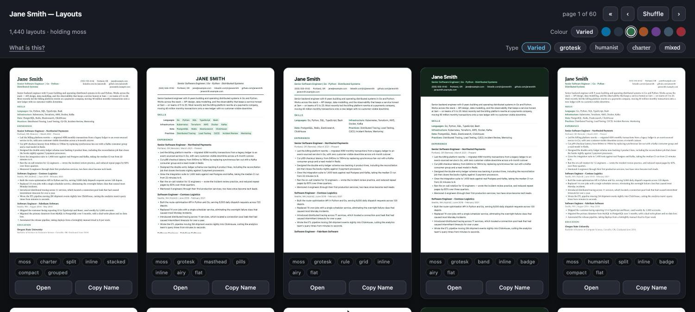

# resume-pipeline

**Browse thousands of resume layouts, check them for parse safety, and publish the one you
pick — from inside your coding agent.**

[](https://github.com/dberardi2020/resume-pipeline/actions/workflows/tests.yml)


Your resume is data, not a document — but every tool treats it as a document, so the file
you send drifts from the file you edit, and choosing how it *looks* means picking from a
handful of themes somebody else designed.

This keeps one structured **profile** as the only thing you edit, generates a **space** of
10,080 layouts from it, and lets you browse that space until something looks right. The
editing happens through your agent: you say what to change, it changes the data. Publishing
writes one deliverable — PDF, HTML and Markdown — from the layout you chose.



**Not another resume generator.** That category is well served and mostly abandoned. Three
things here do not exist elsewhere: layouts as a *design space* rather than a theme list, a
linter that checks a **layout** for parse safety, and a workflow built for an agent to drive
rather than a human to type.

## Model, in six words

- **Profile** — your resume as structured data ([JSON Resume](https://jsonresume.org/schema)).
  The only file you edit. A *superset*: it holds everything you have ever done, including
  what no single resume would show.
- **Axis** — one independent presentation choice. Seven of them: palette, typeface, header,
  skills, promo, density, grouping.
- **Spec** — one point in the space, a value on every axis, named in full:
  `harbor-grotesk-band-pills-ladder-airy-grouped`. Pure data — save it, share it, publish
  against it.
- **Space** — the product of the axes. **10,080 layouts**, enumerated rather than curated.
  Combinatorial, not curated: 28 hand-authored axis values over one skeleton.
- **Variant** — a profile rendered through a spec. What you look at. Cheap and disposable.
- **Deliverable** — the one published output you actually send.

The full product definition is [`docs/concept.md`](docs/concept.md).

## Requirements

- **Python 3.11+**. Zero runtime dependencies — everything is stdlib.
- **A Chromium-family browser** (Chrome, Chromium, Edge, Brave) — used only for PDF export,
  and located at runtime. Everything else works without one.

## Install

**Recommended** — with [pipx](https://pipx.pypa.io):

```sh
pipx install git+https://github.com/dberardi2020/resume-pipeline.git
```

**From a checkout** — no install at all:

```sh
git clone https://github.com/dberardi2020/resume-pipeline.git
cd resume-pipeline
python3 -m venv .venv && .venv/bin/pip install -e .
python3 -m resume_pipeline --help
```

Then scaffold somewhere to keep your resume:

```sh
resume-pipeline init ~/Career     # the workspace, including the agent skill
cd ~/Career/Resume                # fill in resume.json, then:
resume-pipeline lint
resume-pipeline catalogue
```

### Hand it to your coding agent

Already inside Claude Code (or Cursor, or any coding agent)? Paste this and it will do the
setup for you:

```text
Install resume-pipeline from https://github.com/dberardi2020/resume-pipeline

- Preferred: `pipx install git+https://github.com/dberardi2020/resume-pipeline.git`,
  which puts a `resume-pipeline` command on my PATH. If pipx isn't available, clone the
  repo, make a venv, `pip install -e .`, and symlink `.venv/bin/resume-pipeline` onto my
  PATH instead.
- Then run `resume-pipeline init <where I keep my documents>` to scaffold a career
  workspace. That also installs a `career` skill into the workspace's .claude/skills/,
  which teaches you the workflow and the rules — read it before touching my resume.
- Then help me fill in Resume/resume.json, run `resume-pipeline lint`, and build me a
  catalogue of layouts to look at.

It needs Python 3.11+, and a Chromium-family browser for PDF export only. Tell me if
anything is missing.
```

## Commands

The CLI is the substrate. The intended interface is your agent — `init` installs a skill so
it knows all of this without being briefed.

| Verb | What it does |
|---|---|
| `init [dir]` | Scaffold a workspace: `resume.json`, folders, working rules, and the agent skill. `--skill-only` installs just the skill into a folder you already have. |
| `lint` | Check the profile and a layout: parse safety, structure, vague or unquantified claims. |
| `catalogue` | Build a static, browsable folder of layout options. Opens from `file://`, no server. |
| `serve` | The same viewer with a process behind it — previews rendered on request, plus PDF export. |
| `publish --theme <spec>` | Write the deliverable (`.pdf`, `.html`, `.md`) beside the profile. |

The profile path is optional everywhere: commands walk up from the working directory looking
for `resume.json`, or read `RESUME_PIPELINE_RESUME`. `--theme` takes a preset (`default`,
`plain`, `editorial`, `warm`) or any spec name from the catalogue.

**Generated files never sit beside your source.** Scratch renders go to
`~/.cache/resume-pipeline/`; only `publish` writes into the workspace, and only as the one
canonical deliverable — so the folder always answers "which file do I send?" instantly.

## Two rules it will not break

Part of the point is making agent edits *safe*. Two rules carry that, and `init` installs
both into the workspace so your agent reads them before touching anything.

**Never invent a fact about your career.** No metric, no date, no scope claim, no technology
you did not use. This matters because the tooling *creates* the pressure to break it: the
linter flags bullets with no figures, and the obvious way to satisfy a linter is to supply
one. So the linter only ever reports — it asks for the number and leaves the bullet alone.
Rewriting your own facts into stronger prose is the point; introducing new ones is
misrepresentation you would have to defend in an interview and could not.

**Never delete a skill from the profile.** It is a list built over years. Curating which
skills appear in a given variant is a rendering choice, not a deletion.

## On applicant tracking systems

Layout rules here are justified by **mechanism, never by magnitude**. Parsers demonstrably
extract text top-to-bottom and left-to-right, so a two-column layout genuinely scrambles
reading order. That is verifiable, it is sufficient, and it is why every generated layout is
single-column and ≥10pt *by construction* — a test re-extracts published PDFs and asserts the
text comes back in document order.

What you will not find here is a rejection statistic. The ubiquitous "75% of resumes never
reach a human" traces to a vendor that folded in 2013 without ever publishing a study, and
the skeptical counter-numbers are no better sourced. Nobody has good public data, so nothing
here rests on any.

## Status

Early, and honest about it. The space, the viewer, the linter and publishing work and are
tested. These are not built yet:

- **Import** an existing resume (PDF/DOCX → profile) — the biggest gap, since today you
  transcribe once before anything works.
- **Faceted browse** — filter and group the space by axis, rather than viewing a spread of it.
- **An inspector** — a live, read-only view of the profile as it is edited, showing what changed.
- **Provenance** — per claim, whether it is your asserted fact or model-generated prose.
- **Cover letters and applications**, from the same data model.

The backlog is [`docs/tickets/Tickets.md`](docs/tickets/Tickets.md).

## Documentation

- **[Concept](docs/concept.md)** — what this is, the vocabulary, the four surfaces, and what
  v1 means. Start here.
- **[Tickets](docs/tickets/Tickets.md)** — the backlog, open and done.
- **[llms.txt](llms.txt)** — the same orientation for an agent, without cloning.

## License

[MIT](LICENSE) © Dimitri Berardi
